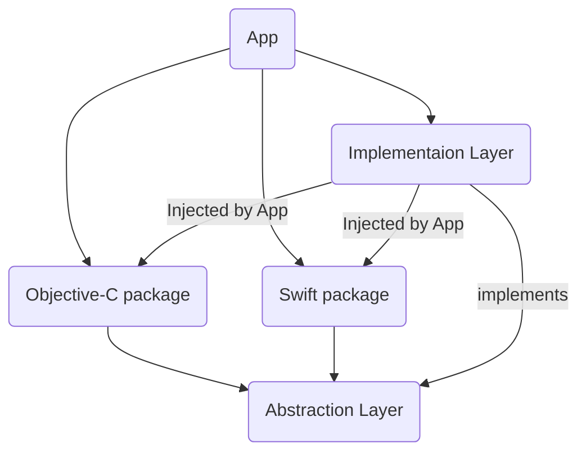

Demo for a Swift package architecture where an Objective-C package which depends on a Swift package fails to be found when used as a dependency.
See https://github.com/apple/swift-package-manager/issues/5951

The solution is to introduce an abstraction layer to break the direct dependency chain.

